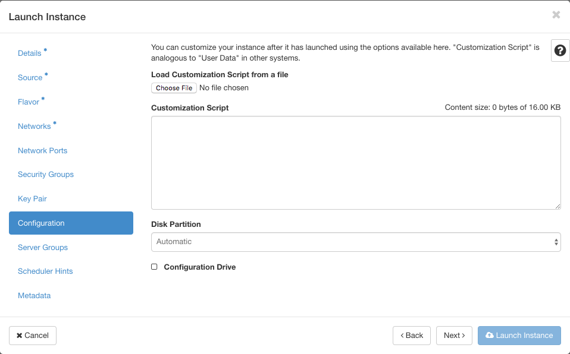

Bootstrap on Openstack
======================

Bootstrapper can build tar.gz archives using custom bootstrap.xml and init-cfg templates. This archive can then be
attached to the instance using the user-data flag. Most newer versions of Openstack require base64 encoded
user-data archives. Panos-bootstrapper supports both tar.gz formatted archives as well as base64 encoded
tar.gz archives. The Openstack deployment option uses the encoded tar.gz format by default.

Example Instance Creation
-------------------------

.. code-block:: bash

    curl -J -O  -X POST -d "hostname=panos-vm-01" -d "archive_type=encoded_tgz"  localhost:5001/generate_bootstrap_package

    nova boot --config-drive true --image <pan-os-image-file-name> --flavor <flavor> --user-data ./panos-vm-01.tgz.base64
    --security-groups <security-group> --nic net-id=<mgmt nic net-id> --nic net-id=<eth1 nic net-id>
    --nic net-id=<eth2 nic net-id> panos-vm-01

Bootstrapping with the Openstack Horizon UI
--------------------------------------------

Bootstrapping a VM-Series NGFW using the Openstack Horizon can be done by first creating the archive
using the 'encoded_tgz' deployment type option. Then choosing that file in the 'Load Customization Script from a file'
dialog in the Instance creation pop-up. You must also ensure 'Configuration Drive' is selected.

More Information
----------------

To complete the bootstrap process, refer to the official documentation:

`Bootstrap the VM-Series Firewall on KVM in OpenStack <https://www.paloaltonetworks.com/documentation/81/virtualization/virtualization/bootstrap-the-vm-series-firewall/bootstrap-the-vm-series-firewall-on-kvm/bootstrap-the-vm-series-firewall-on-kvm-in-openstack>`_

.. Note::
    You may need to open a new browser window to follow links to external sites when viewing these docs in an embedded environment like Bootstrapper-UI

